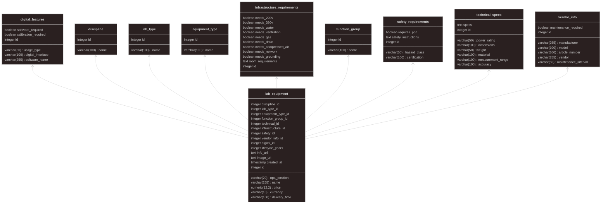

# Проект базы данных для лабораторного оборудования

Этот проект является ответом на задание по производственной практике и демонстрирует два подхода к проектированию схемы базы данных для учета лабораторного оборудования.

## Скрипты

В проекте представлены два SQL-скрипта:

### 1. `one_table.sql`

Этот скрипт создает единую, денормализованную таблицу с именем `Lab_Equipment`.

*   **Подход:** Все атрибуты оборудования собраны в одной таблице.
*   **Преимущества:** Простота запросов, так как не требуется соединять таблицы (JOINs).
*   **Недостатки:** Избыточность данных, возможные аномалии при обновлении, добавлении и удалении данных.

### 2. `normalized.sql`

Этот скрипт создает нормализованную схему базы данных, состоящую из нескольких связанных таблиц.

*   **Подход:** Данные разделены на логические группы и хранятся в отдельных таблицах (`discipline`, `lab_type`, `technical_specs`, `safety_requirements` и т.д.). Основная таблица `lab_equipment` связывает все данные с помощью внешних ключей (FOREIGN KEYs).
*   **Преимущества:** Устранение избыточности данных, обеспечение целостности данных, большая гибкость и масштабируемость.
*   **Недостатки:** Усложнение запросов, так как для получения полной информации требуется соединение нескольких таблиц.

